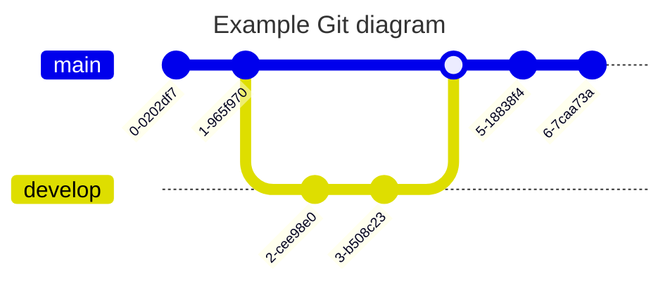

# Out of the Box
Visual Studio Code bietet Out of the Box eine gute Unterstützung für Markdown, sowohl Syntaxhighlighting für `.md` Dateien, als auch Rendering für eine Vorschau.

## Vorschau anzeigen
Um die Markdown Vorschau anzuzeigen, kann die Tastenkombination

    [Ctrl]-[K], V

verwendet werden, oder über die Kommando-Palette:

    > Markdown: Open Preview

## Codeblöcke

```cpp
class Foo
{

};
```

## Listen
Ungeordnete Listen
- Eintrag
- Eintrag
  - Untereintrag
  - Noch einer
- Und so weiter

Nummerierte Listen
1. Test
2. Hallo
3. Welt
3. Die Nummerierung muss nichtmal stimmen :facepalm:

# Erweiterungen

## Diagramme

### Mermaid
Extension: [Markdown Preview Mermaid Support](https://marketplace.visualstudio.com/items?itemName=bierner.markdown-mermaid)

#### Entity Relationship Diagramm
[Dokumentation](https://mermaid.js.org/syntax/entityRelationshipDiagram.html)


#### State Machine
[Dokumentation](https://mermaid.js.org/syntax/stateDiagram.html)


#### Architektur
[Dokumentation](https://mermaid.js.org/syntax/architecture.html)


#### Mind Map
[Dokumentation](https://mermaid.js.org/syntax/mindmap.html)


#### Block Diagramm
[Dokumentation](https://mermaid.js.org/syntax/block.html)


#### Klassendiagramm
[Dokumentation](https://mermaid.js.org/syntax/classDiagram.html)


#### Git Graph
[Dokumentation](https://mermaid.js.org/syntax/gitgraph.html)



#### Gantt
[Dokumentation](https://mermaid.js.org/syntax/gantt.html)


#### User Journey
[Dokumentation](https://mermaid.js.org/syntax/userJourney.html)


#### Flow Chart
[Dokumentation](https://mermaid.js.org/syntax/flowchart.html)


#### Tortendiagramm
[Dokumentation](https://mermaid.js.org/syntax/pie.html)


#### C4 Diagramm
[Dokumentation](https://mermaid.js.org/syntax/c4.html)
[C4 Website](https://c4model.com/)


### PlantUml
Extension: [Markdown Plantuml Preview](https://marketplace.visualstudio.com/items?itemName=myml.vscode-markdown-plantuml-preview)

[:link: PlantUml Website](https://plantuml.com/de/)

#### Sequenz Diagramm


#### Test


### Graphviz


## Emojis
Extension: [Markdown Emoji](https://marketplace.visualstudio.com/items?itemName=bierner.markdown-emoji)

:+1: :x: :exploding_head:

## Fußnoten
Extension: [Markdown Footnotes](https://marketplace.visualstudio.com/items?itemName=bierner.markdown-footnotes)

Fußnoten wie diese^[Test] können ebenfalls eingefügt werden.

## Checklisten
Extension: [Markdown Checkboxes](https://marketplace.visualstudio.com/items?itemName=bierner.markdown-checkbox)

- [ ] Punkt 1
- [ ] Punkt 2

