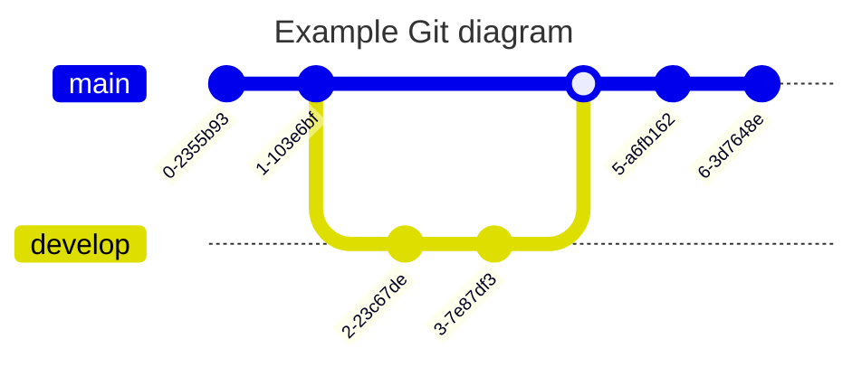

# Präsentation Dokumentations Tools

[ToC]

# To Do Liste
- [x] Abbreviation Syntax bei GitHub testen -> Funktioniert nicht
- [ ] Abschnitt über Multimarkdown (`.mmd`)
- [ ] Heading IDs testen
- [ ] Erweiterungen für Tabellen testen
- [ ] Abschnitt über Verlinkungen
- [x] Konvertierungs Tools (Pandoc)
- [ ] Kurzvorstellung C4 
- [ ] Abschnitt über Structurizr @Henning
- [ ] Wort zum Sonntag zum Thema SharePoint :skull:


# Markdown

Markdown ist ein Format um strukturierte und formatierte Texte zu verfassen. Markdown Dateien (`.md`) sind einfache Textdateien, die mit jedem Texteditor bearbeitet werden können. Ziel des Erfinders der Sprache war es, ein Textformat zu schaffen, das sowohl einfach zu schreiben, als auch einfach zu lesen ist^[https://en.wikipedia.org/wiki/Markdown#History].

## Feature Übersicht

| Feature                     | VS Code            | Joplin                 | [HedgeDoc](https://demo.hedgedoc.org/features) | [GitHub](https://github.com/fhuber-arag/markdown-demo)             | [BitBucket](https://bitbucket.arag.com/users/a503111/repos/markdown-test) |
|----------------------------:|:-------------------|:-----------------------|:--------------------------|:-------------------|:-------------------|
| [Mermaid](#mermaid)         | :white_check_mark: | :white_check_mark:     | :white_check_mark:[^hdmm] | :white_check_mark: | :x:                |
| [PlantUml](#plantuml)       | :white_check_mark: | :package:              | :x:                       | :x:                | :x:                |
| [Graphviz](#graphviz)       | :package:          | :x:                    | :white_check_mark:        | :x:                | :x:                |
| [Abkürzungen](#abkürzungen) | :x:                | :white_check_mark:[^1] | :white_check_mark:        | :x:                | :x:                |
| [Emojis](#emojis)           | :package:          | :white_check_mark:[^1] | :white_check_mark:        | :white_check_mark: | :hankey:           |
| [Fußnoten](#fußnoten)       | :package:[^vsfn]   | :white_check_mark:[^1] | :white_check_mark:        | :white_check_mark: | :x:                |
| [Checkboxen](#checklisten)  | :package:          | :white_check_mark:[^1] | :white_check_mark:        | :white_check_mark: | :x:                |
| [Zitate](#zitate)           | :white_check_mark: | :white_check_mark:     | :white_check_mark::+1:    | :white_check_mark: | :white_check_mark: |

[^hdmm]: Version 9.1.7, ziemlich veraltet. Aktuell ist 11.6
[^vsfn]: Sehen seltsam aus
[^1]: Muss aktiviert werden

## Überschriften

Eine Überschrift wird durch ein oder mehrere Rautezeichen `#` eingeleitet. Die Anzahl der Rauten entspricht dabei der Überschrifen-Ebene, wobei bis zu 6 Ebenen unterstütz werden.

```
# Überschrift 1
## Überschrift 2
### Überschrift 3
#### Überschrift 4
##### Überschrift 5
###### Überschrift 6
```

Viele Tools erstellen aus den Überschriften automatisch Inhaltsverzeichnisse und Navigationsleisten, so dass sich Überschriften hervorragend eignen, ein Markdown Dokument zu strukturieren.

## Textformatierung

Standard Markdown unterstützt die folgenden Formatierungen:

| Schreibweise          | Formatierung        |
|-----------------------|---------------------|
| `*kursiv*`            | *kursiv*            |
| `**fett**`            | **fett**            |
| `***beides***`        | ***beides***        |
| `~~durchgestrichen~~` | ~~durchgestrichen~~ |

Darüber hinaus bieten verschiedene Tools weitergehende Möglichkeiten an:

| Schreibweise                     | Formatierung                   | Unterstützt durch |
|----------------------------------|--------------------------------|-------------------|
| `<font color="red">Farbe</font>` | <font color="red">Farbe</font> | VS Code, Joplin, HedgeDoc, BitBucket :question:
| `<ins>unterstrichne</ins>`       | <ins>Unterstrichen</ins>       | VS Code, GitHub, BitBucket, Joplin, HedgeDoc
| `<marquee>lol</marquee>`         | <marquee>lol</marquee>         | VS Code, Joplin, :question:


## Codeblöcke

Ein Codeblock wird durch drei Backticks `` ` `` (Accent Grave) oder drei Tilden `~` eingeleitet:

~~~cpp
class Foo
{

};
~~~

Die Schreibweise mit Tilde kann manchmal notwendig sein, wenn bestimmte externe Programme verwendet werden.

Die meisten Markdown Renderer versuchen die Sprache automatisch zu erkennen; besser ist es jedoch, die Sprache explizit hinter dem dritten Backtick anzugeben (Visual Studio Code bietet innerhalb des Code
Blocks nur Syntax Highlighting an, wenn die Sprache explizit genannt wird).

Eine Liste verfügbarer Sprachen siehe [hier](https://docs.readme.com/rdmd/docs/code-blocks#language-support) oder die [Linguist Dokumentation](https://github.com/github-linguist/linguist/blob/main/lib/linguist/languages.yml).

## Inline Code
Codeschnipsel wie Funktionsnamen, aber auch Dateipfade, können im Fließtext mit einfach Backticks eingefasst werden; das sieht dann so aus: `int main(int, char**)`. **Hinweis**: Einfache Tilde funktioniert leider nicht.

## Listen
Ungeordnete Listen
- Eintrag
- Eintrag
  - Untereintrag
  - Noch einer
- Und so weiter

Nummerierte Listen
1. Test
2. Hallo
3. Welt
3. Die Nummerierung muss nichtmal stimmen :facepalm:

## Tabellen

| Spalte 1    | Spalte 2 | Spalte 3      |
|:------------|:---------:|-------------:|
| Hallo       | Welt      | 42           |
| Foo         | Bar       | 1337         |
| Linksbündig | Zentriert | Rechtsbündig |

## Abkürzungen
*[Beispiel]: Mal sehen, ob das funktioniert :+1:

Ein Beispiel.

## Zitate

> Dies ist ein zitat
> > Dies ist ein Unterzitat.
> > Für den Fall, dass man mal eine ausgedehnte Email Korrespondenz in Markdown abbilden muss :rofl:

[HedgeDoc](https://demo.hedgedoc.org/features?both#Blockquote-Tags) bietet den Besten Support für Zitate an. Es werden Quellen- und Zeitangaben sowie Farben unterstützt.

## Erweitertes Markdown

### Diagramme
Es gibt drei verbreitete Möglichkeiten, Diagramme in Markdown einzubinden:

- [Mermaid](https://mermaid.js.org/)
- [PlantUml](https://plantuml.com/de/)
- [Graphviz](https://graphviz.org/)

Mermaid bietet die breiteste Unterstützung, z.B. durch GitHub.

#### Mermaid

##### Entity Relationship Diagramm
[Dokumentation](https://mermaid.js.org/syntax/entityRelationshipDiagram.html)


##### State Machine
[Dokumentation](https://mermaid.js.org/syntax/stateDiagram.html)


##### Architektur
[Dokumentation](https://mermaid.js.org/syntax/architecture.html)


##### Mind Map
[Dokumentation](https://mermaid.js.org/syntax/mindmap.html)


##### Block Diagramm
[Dokumentation](https://mermaid.js.org/syntax/block.html)


##### Klassendiagramm
[Dokumentation](https://mermaid.js.org/syntax/classDiagram.html)


##### Git Graph
[Dokumentation](https://mermaid.js.org/syntax/gitgraph.html)



##### Gantt
[Dokumentation](https://mermaid.js.org/syntax/gantt.html)


##### User Journey
[Dokumentation](https://mermaid.js.org/syntax/userJourney.html)


##### Flow Chart
[Dokumentation](https://mermaid.js.org/syntax/flowchart.html)


##### Tortendiagramm
[Dokumentation](https://mermaid.js.org/syntax/pie.html)


##### C4 Diagramm

[Dokumentation](https://mermaid.js.org/syntax/c4.html)

[C4 Website](https://c4model.com/)


#### PlantUml
Extension: [Markdown Plantuml Preview](https://marketplace.visualstudio.com/items?itemName=myml.vscode-markdown-plantuml-preview)

[:link: PlantUml Website](https://plantuml.com/de/)

##### Sequenz Diagramm


##### Klassendiagramm


##### Bewertung
- Veraltete Optik, etwas klobig und relativ schlechte Tool-Unterstützung
- Beste Klassendiagramme (Subjektiv?)

#### Graphviz


### Emojis
Extension: [Markdown Emoji](https://marketplace.visualstudio.com/items?itemName=bierner.markdown-emoji)

:+1: :x: :exploding_head:

### Fußnoten
Extension: [Markdown Footnotes](https://marketplace.visualstudio.com/items?itemName=bierner.markdown-footnotes)

Fußnoten wie diese^[Test] können ebenfalls eingefügt werden.

Es gibt zwei leicht unterschiedliche Syntaxen für Fußnoten. Die erste fügt die Fußnote an Ort und Stelle ein:

```markdown
Dieser Satz hat eine Fußnote^[Und dieser Text wird unten angezeigt]
```

Bei der zweiten Schreibweise sind Verwendung und Definition der Fußnote getrennt (:exclamation: Vorsicht: Das Zirkumflex steht hier **in** dem eckigen Klammerpaar!):

```markdown
Dieser Satz hat ebenfalls eine Fußnote[^ref_footnote_1].

[^ref_footnote_1]: Und dieser Text wird unten angezeigt. Er kann darüber hin aus viel länger sein und mehrmals verwendet werden
```

Beispiel für eine sehr lange Fußnote[^ref_long_footnote].

[^ref_long_footnote]:
    Wer reitet so spät durch Nacht und Wind?

    Es ist der Vater mit seinem Kind;

    Er hat den Knaben wohn in dem Arm,

    Er faβt ihn sicher, er hält ihn warm.


### Checklisten
Extension: [Markdown Checkboxes](https://marketplace.visualstudio.com/items?itemName=bierner.markdown-checkbox)

- [ ] Punkt 1
- [ ] Punkt 2

# Tools

## Visual Studio Code

### Out of the Box
Visual Studio Code bietet Out of the Box eine gute Unterstützung für Markdown, sowohl Syntaxhighlighting für `.md` Dateien, als auch Rendering für eine Vorschau.

### Vorschau anzeigen
Um die Markdown Vorschau anzuzeigen, kann die Tastenkombination

    [Ctrl]-[K], V

verwendet werden, oder über die Kommando-Palette (`[Strg]-[Shift]-[P]`)

    > Markdown: Open Preview

### Erweiterungen

Extension: [Markdown Preview Mermaid Support](https://marketplace.visualstudio.com/items?itemName=bierner.markdown-mermaid)

## Joplin

[:link: Joplin Markdown Guide](https://joplinapp.org/help/apps/markdown/)

## HedgeDoc

## GitHub

[:link: Writing on GitHub](https://docs.github.com/en/get-started/writing-on-github)

[:link: GitHub Flavored Markdown Spec](https://github.github.com/gfm/)

## BitBucket

[:link: BitBucket Markdown Tutorial](https://bitbucket.org/tutorials/markdowndemo/src/master/)

## Pandoc

[Pandoc](https://pandoc.org/) ist ein Konsolenbasiertes Werkzeug, mit dem eine große Zahl von Textformaten ineinander konvertiert werden können, unter anderem Markdown.

Die Konvertierung kann wie folgt angestoßen werden:

```bash
pandoc README.md -o README.pdf
```

Die Option `-o` spezifiziert die zu erstellende Datei; das Ausgabeformat wird anhand der Dateiendung erkannt, kann aber auch mit der Option `-t` explizit angegeben werden (s.u.).

Interessante Ausgabeformate sind u.a.:
- `docx`(Word)
- `pdf` (PDF)
- `html` (HTML5)
- `latex` (LaTeX)
- `epub` (EPUB v3)
- `opendocument` (OpenOffice Dokument)
- `pptx` (PowerPoint)

Für eine vollständige Liste der Formate, s. `-t FORMAT` in [Pandoc Options](https://pandoc.org/MANUAL.html#options).
